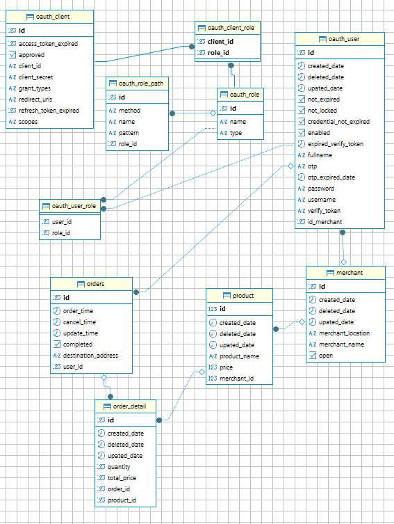

Restaurant Menu & Ordering System

This project is a **restaurant menu and ordering system** that evolves over six development phases, integrating core software engineering concepts, database management, security, and API development.

## 🚀 Features
- **📜 Menu Management**: View, add, update, and delete menu items.
- **🛒 Order Processing**: Customers can place and modify orders, with receipt generation.
- **🔑 Secure Authentication**: JWT-based authentication & OAuth2 for secure login.
- **🛠️ Role-Based Access**: Customers, Merchants, and Admins with different permissions.
- **📊 Reports & Analytics**: Jasper Reports for order summaries and sales tracking.
- **☁️ Cloud Deployment**: Hosted on **Railway.app**

---

## 🏗️ Tech Stack
### **Backend**
- **Java 8** (Core Language)
- **Spring Boot 2** (Framework)
- **Spring Data JPA** (Database Access)
- **Spring Security & OAuth2** (Authentication & Authorization)

### **Database & Persistence**
- **PostgreSQL** (Primary Database)
- **Hibernate (JPA)** (ORM for database interaction)

### **API Documentation & Testing**
- **Swagger (Springdoc OpenAPI)** (API Documentation)
- **JUnit & Mockito** (Unit & Integration Testing)
- **Postman** (Manual API Testing)

### **Reporting & Deployment**
- **Jasper Reports** (PDF Report Generation for Orders & Sales)
- **Railway.app** (Cloud Deployment)
- **Docker** (Containerization for scalability)

---

## 📚 API Documentation

The API documentation is available at [http://localhost:8081/swagger-ui.html](http://localhost:8081/swagger-ui.html) after starting the server.

---

## 🛠️ How to Run the Project Locally

Follow these steps to get the project up and running locally.

### Prerequisites

Make sure you have the following installed on your machine:

- Java JDK 8
- Maven
- PostgreSQL

### Installation

1. Clone the repository:

```bash
git clone https://github.com/Dikus21/food-ordering-api.git
cd food-ordering-api
```

2. Set up the PostgreSQL database and configure the application properties.

3. Install dependencies and build the project
```bash
mvn clean install
```

### Start the server

```bash
mvn spring-boot:run
```
## ERD



## Contact

For any questions or inquiries, please contact me at [andikatirta001@gmail.com](mailto:andikatirta001@gmail.com)


### This `README.md` format includes your tech stack, repository link, API documentation link, and all the necessary details to get started with the project. Adjust the deployment URL and other placeholders as needed.
